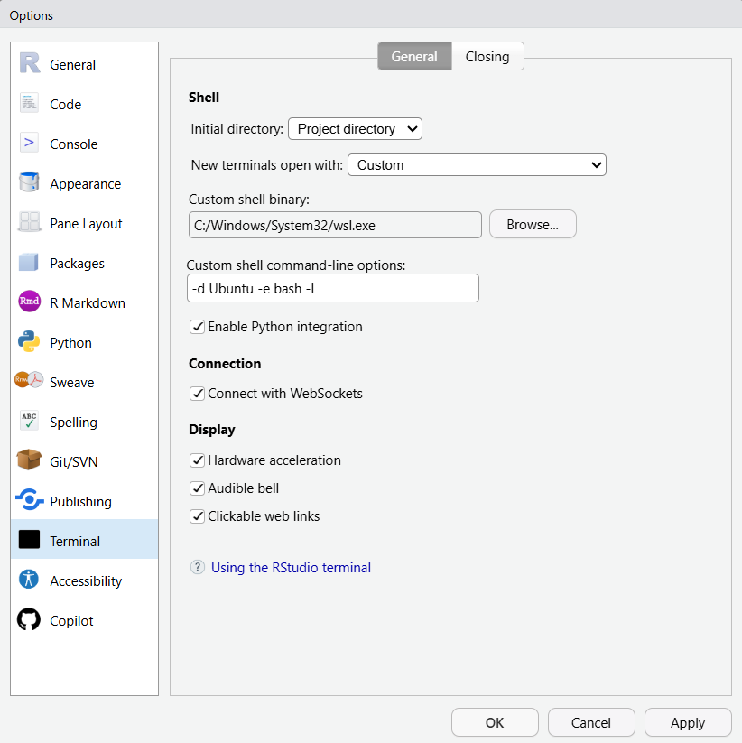

# Ubuntu Terminal in Windows RStudio

This is how you set up the RStudio installed in windows to access your WSL Ubuntu terminal

---

## 1. Confirm your distro name in PowerShell

Open Windows Terminal / CMD and run:

```
wsl.exe -l -v
```

Example:

```
Windows PowerShell
Copyright (C) Microsoft Corporation. All rights reserved.

Install the latest PowerShell for new features and improvements! https://aka.ms/PSWindows

PS C:\Users\cbird> wsl.exe -l -v
  NAME                   STATE           VERSION
* Ubuntu                 Running         2
  Ubuntu-24.04           Running         2
  docker-desktop-data    Stopped         2
  docker-desktop         Stopped         2
PS C:\Users\cbird>
```

I'm going to use "Ubuntu".  You should choose the one that you've been using.

---

## 2. Set RStudio’s Terminal to WSL Ubuntu

* In RStudio: Tools → Global Options → Terminal

  * New terminals open with: Custom

  * Shell: C:\Windows\System32\wsl.exe

  * Arguments: `-d <YourDistroName> -e bash -l`

Example: `-d Ubuntu -e bash -l`



Click OK.

Open a new terminal tab in RStudio (Terminal → New Terminal) and you should land in your Ubuntu shell.
