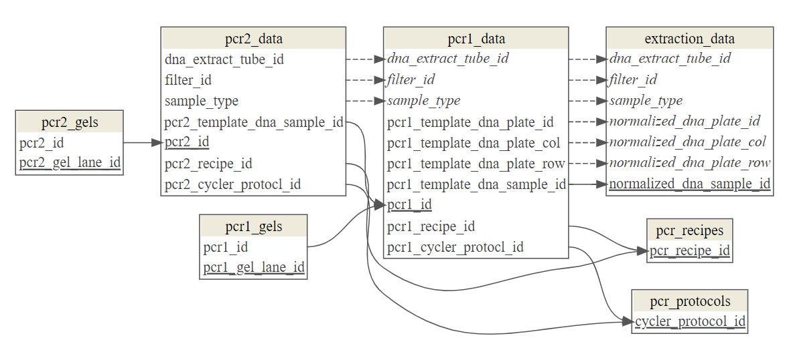

# How to Organize Biological Data

#### Who This Guide is For

This guide was designed for students in the classes and lab of Dr. Chris Bird at TAMU-CC, but might alse benefit a wide range of individuals engaged in biological research, including undergraduate students, graduate students, and early-career researchers. Whether you are new to organizing data or looking to refine your current practices, this guide will provide you with the foundational principles and practical strategies needed to manage your biological data effectively.

#### Why Data Organization Matters

Proper data organization is not just a matter of convenience—it's a critical component of rigorous scientific practice. Well-organized data ensures that your research can be easily understood, reproduced, and built upon by others. In an era where transparency and data sharing are becoming increasingly important, your ability to provide a clear, organized dataset is essential for collaboration and for complying with data management requirements imposed by funding agencies and journals.

By following the principles outlined in this guide, you'll not only streamline your current projects but also future-proof your research, making it easier to revisit, analyze, and share your findings down the line.

---

## Tidy Data

It is important to be deliberate and methodical in the organization of your data.  You will likely work with many data formats, most of them being unwieldy and not "[tidy](https://vita.had.co.nz/papers/tidy-data.pdf)".  You do, however, have control over the data that you record manually and the information that you extract and wrangle in computer code from raw data files of varying formats.  For most biologists, the tidy format be the most benficial and easy to understand.


Figure 1.  From [R for Data Science](https://r4ds.hadley.nz/data-tidy).  In tidy data, one file holds one table. In each table, the rows are observations and the columns are variables that store information about the observations.  Each row should contain only 1 observation.  Each column should contain only 1 variable.  Notes about an observation can be made in a column named `notes`.  One column should contain the `observation_id` which is a [unique identifier](https://en.wikipedia.org/wiki/Unique_identifier) assigned to that observation.

#### Why Tidy Data Matters

For most biologists, working with data in a tidy format is not only beneficial but essential for effective data analysis. Tidy data is structured in a way that makes it easy to manipulate, analyze, and visualize using various statistical tools and programming languages, such as R and Python. The tidy format ensures consistency across datasets, reducing the likelihood of errors and simplifying the process of integrating data from different sources.  This tidy structure also allows for straightforward operations, such as filtering, summarizing, and visualizing data, because the relationships between variables are clear and unambiguous.

#### Making Data Tidy

For manually recoreded data, you can type it into a spreadsheet in the tidy format and that will save you time in the downstream processing of your data.  If your data isn’t already in a tidy format, you can transform it using data wrangling tools like those available in R (e.g., tidyverse packages). You should not manually convert your data to tidy format because the changes are not tracked an it will be difficult to correct mistakes, e.g. don't convert untidy data in a spreadsheet to tidy data using M.S. Excel. 

---

## Data Science Philosophy (Document All Data Manipulations)

In today’s research environment, transparency and reproducibility are not just ideals but requirements. Many scientific journals now require that you provide the scripts used to process your data as part of your publication. This practice is increasingly important because it ensures that your research can be independently verified and built upon by others.

The tradition, in Biology, is for data to be manipulated manually in a spreadsheet on a computer. It is still necessary in many cases to manually type data into a computer to digitize it. However, after that data is digitized, we need to break with tradition and embrace more rigorous protocols when manipulating and processing the data.

On key principle of data science is: *all manipulations and analyses of digitized data should be documented and executed in code*. This facilitates transparency, reproduction of methods, and verification. By documenting all data manipulations and analyses in code, you create a transparent record of your workflow. This not only allows others to follow your methods but also protects you from potential errors that can arise from manual data handling. 

#### Practical Example: Data Cleaning

Let’s say you’ve digitized field data in a spreadsheet that includes observations of various species across different locations and dates. The data needs to be cleaned before analysis, such as standardizing species names, removing duplicates, or filtering out incomplete records. Instead of manually editing the spreadsheet, you should write a script to perform these tasks. This approach not only saves time but also ensures that the process can be easily replicated.

Box 1. Example R code to clean field data typed into a spreadsheet, then converted to a [CSV file](https://en.wikipedia.org/wiki/Comma-separated_values).

```r
# Load necessary packages
library(dplyr)

# Import raw data
raw_data <- read_csv("field_data.csv")

# Clean the data
clean_data <-
  raw_data %>%
  mutate(species = tolower(species)) %>%   # Standardize species names
  filter(!is.na(location)) %>%             # Remove records with missing locations
  distinct()                               # Remove duplicate records

# Save the cleaned data
write_csv(
  clean_data,
  "field_data_clean.csv",
  row.names = FALSE
)

```

#### Practical Example: Joining Data Tables 

GIS data in a field project will often be collected using a handheld GPS which stores that information in a `gpx` file.  To [join](https://en.wikipedia.org/wiki/Relational_algebra#Joins_and_join-like_operators) that GPS data with the cleaned field [metadata](https://en.wikipedia.org/wiki/Metadata), you should write the commands in a file (script) that can be executed by a computer to ensure reproducibility and accuracy. 

Box 2. Example R code to join GPS waypoints stored in a `gpx` file with a tidy table with additional information (metadata) about each location.

```r

# Load necessary packages
library(dplyr)
library(sf)              # For handling spatial data
library(tidyverse)       # For data wrangling
library(tmaptools)       # For reading GPX files

# Import GPS waypoints from GPX file
gpx_data <-
  st_read(
    "waypoints.gpx",
    layer = "waypoints"
  )

# Import additional metadata from a CSV file
metadata <- read_csv("field_data_clean.csv")

# Clean and prepare data for joining
gpx_data_clean <-
gpx_data %>%
  select(                 # Select relevant columns and rename
    name,
    lat = coords.x1,
    lon = coords.x2
  )  

metadata_clean <-
  metadata %>%
  mutate(location_id = tolower(location_id))  # Standardize location IDs if needed

# Join the GPX data with the metadata
combined_data <-
  gpx_data_clean %>%
  left_join(
    metadata_clean,
    by = c("name" = "location_id")
  )

# Save the combined data to a CSV file for further analysis
write_csv(
  combined_data,
  "combined_location_data.csv",
  row.names = FALSE
)

```

---

## Relationships Between Data Files (Databases)

When considering all data for a MS Thesis, Ph.D. Dissertation chapter, or a publication in a scientific journal; most projects will involve many unique tidy tables which need to be organized into a [database](https://en.wikipedia.org/wiki/Database). We will focus on organizing our data based upon the relational model (Codd 1970) as a [relational database](https://en.wikipedia.org/wiki/Relational_database).  The relational database we describe here consists of several tidy data files that are connected by common columns of values (keys).  

The [primary key](https://en.wikipedia.org/wiki/Primary_key) is the column with a unique value for each observation (row) or a set of columns that uniquely define an observation when combined. In Fig. 2 below, the column named `faa` is the primary key for the `airports` table. In contrast, the `flights` table has a primary key comprized of the columns named `year`, `month`, `day`, `hour`, and `flight`. 

A [foreign key](https://en.wikipedia.org/wiki/Foreign_key) is a column in one tidy table that contains the same values as the primary key of another tidy table. Foreign keys typically contain values that are duplicated in several rows. In Fig. 2 below, the columns named `origin` and `dest` in the `flights` data file are both foreign keys in relation to the `faa` primary key of the `airports` data file. These columns all contain FAA airport codes. This relationship is signified by the lines that start at the primary key and point at the foreign key.  In `airports`, every row of the `faa` column contains a unique aiport code.  On the other hand, since there are many flights that share the same airport code, the `flights` data file contains many rows with the same airport codes in the `origin` and `dest` columns. 


Figure 2. From [R for Data Science](https://r4ds.had.co.nz/relational-data.html). [Entity relationship](https://en.wikipedia.org/wiki/Entity%E2%80%93relationship_model) diagram (ERD) depicting the relationships between tidy tables of data in a relational database. There are 5 data tables represented: airports, flights, weather, planes, and airlines. Only the keys in each table are names, e.g. `faa` in airports, etc... Primary keys are denoted with shading.  Foreign keys are denoted as unshaded. All other columns are represented by `...`. Lines in the diagram depict the relationships between pairs of columns by originating at the primary and terminating at the matching foreign key in the relationship.   

It is advisable to create an ERD such as that displayed in Fig. 2 for your research project _before_ you collect the data.  The less thought you put into organizing your data prior to collecting it, the more time and lines of code it will take to organize the data into a relational database that can be easily analyzed.  

#### [Example: Use `dm` R package to connect dataframes into a relational database and make ERD](howto_relational-database-R.md)



---

## Naming of Files, Columns, and Directories

#### Consistency in Naming

Consistent and descriptive naming conventions are crucial for organizing your data in a way that is intuitive and easy to navigate. All files, columns, and directories should be named using human-readable and understandable words or widely used acronyms, avoiding abbreviations that might not be clear to others (or to yourself in the future). The contents of the file and the columns should be self-evident from their names.

#### Examples of Naming Conventions

1. File Names:
   * GPS Waypoints: Instead of using a generic name like `data1.gpx`, use a descriptive name like `gps_waypoints_siteA_2023.gpx`. This name indicates the file contains GPS waypoints for Site A collected in 2023.
   * Environmental Data: A file containing environmental data collected from a specific site might be named `env_data_siteA_2023.csv`.
   * Sample Metadata: Metadata related to biological samples could be named `sample_metadata_experiment1.csv`, clearly indicating its content and context.

2. Column Names:
   * Latitude and Longitude: Instead of `la`t and `long`, use `latitude` and `longitude` to clearly indicate the geographical coordinates.
   * Species Names: For a column containing species names, instead of using `sp_name`, use `species_name`. This avoids confusion and ensures clarity.
   * Measurement Data: If you're recording measurements, name your columns descriptively, such as `leaf_length_mm` instead of just `length`. This indicates that the measurement is of leaf length and is recorded in millimeters. The context given by the word "length" ensures that the abbreviation "mm" will be interpreted as "millimeters", so the abbreviation is ok in this case.

3. Directory Names:
   * Raw Data: A directory for storing unprocessed data files should be named `data_raw/` rather than just `raw/` or `rawdata/`. This clearly indicates that it contains raw data.  Note that if a hierarchical directory structure is chosen, then `data/raw` is acceptable because the word "raw" is contextualized by the name of its parent directory `data/`.
   * Processed Data: Similarly, use `data_processed/` for directories containing cleaned and processed data files.
   * Results and Outputs: A directory containing analysis results could be named `results/` or `output/` rather than just saving the files into `data/`.
        
#### General Guidelines

* Avoid Spaces: Use underscores or hyphens instead of spaces in file, column, and directory names. For example, `sample_data.csv` is preferred over `sample data.csv`.
* Use Lowercase: Stick to lowercase for names to avoid issues with case sensitivity on different operating systems.
* Be Descriptive: Names should provide enough information so that anyone (including your future self) can understand what the file, column, or directory contains without having to open it.

By following these conventions, you create a structure that is not only easy to navigate but also facilitates collaboration with others. Clear and consistent naming helps ensure that your project remains organized and accessible, both now and in the future.

---

## Universal Directory Structure

For the vast majority of biological projects, the files can and should be organized in a common directory (folder) structure. This facilitates transparency and collaboration among multiple scientists. However, it’s important to remember that these structures are starting points and can be adapted to fit the specific needs of your project. If we do not deliberately plan the directory structure of a project and be disciplined in following that plan, the resulting computer directory names and structure can often only be navigated by the person who created it.  And if enough time passes, not even the creator of the project directory can efficiently navigate it. The goal is create a directory structure that can be navigated by anybody without your assistance.

#### General Guidelines

* Minimize the number of directories by only creating those that are needed to organize the files adequately
   * _Use Descriptive Filenames_: Rather than creating new directories for each file type or stage, use descriptive filenames that include relevant information, such as `data_processed_2023.csv` or `data_cleaned_v2.txt`. This approach can reduce the need for additional directories while maintaining clarity
   * _Combine Similar Tasks_: Where possible, combine similar tasks into a single directory. For instance, if you have scripts for both data processing and analysis, you might keep them in a single `scripts/` directory rather than creating separate `data_processing/` and `analysis/` directories.
   * _Different Stages of Workflow_: If your workflow involves distinct stages that produce very different types of outputs (e.g., raw vs. final results), use directories to separate these stages, but keep this to a minimum. For example, you might have just `data/`, `scripts/`, and `results/`.
    * Prioritize Simplicity: When in doubt, prioritize simplicity and clarity over the creation of additional directories. This helps maintain an organized and easy-to-navigate project structure.
      
* Minimize the number of hierarchically nested directories and the number of hierarchical levels.
   * _Flat Structure with Contextual Naming_: Aim for a flat directory structure where possible. Use filenames that provide context, so additional subdirectories aren't necessary. For example, store all raw and processed data in a single `data/` directory, but distinguish between them with filenames like `raw_data_2023.csv` and `processed_data_2023.csv`.
   * _Significant File Volume_: Create a new directory only when a single directory becomes unmanageable (e.g., more than 20-30 files), and only if grouping files by type or purpose would significantly enhance clarity.

* Create a `README.md` file in each directory to describe the contents. [Consult this guide to formatting the contents of a *.md file](https://docs.github.com/en/get-started/writing-on-github/getting-started-with-writing-and-formatting-on-github/basic-writing-and-formatting-syntax).
   * First, it takes time to make a `README.md` so this should help to minimize the number of dirs
   * It is important to orient the directory navigator to the files contained in each dir.  

#### Simple Project: Baseline Structure

For many projects, such as a short-term experiment, a class project, or even a MS Thesis or a single peer-reviewed publication, the following directory structure is likely to be adequate:

``` css
project_name/
├── data_raw/
├── documentation/
├── output/
├── scripts/
├── results/
└── references/
```

Example: Plant Growth Study

* `data/`: Contains both unprocessed and processed data files, e.g., `growth_measurements.csv` and `soil_samples.csv`, as well as `growth_measurements_cleaned.csv` after removing outliers and normalizing data.
* `documentation/`: Holds the the manuals of commercial products like `thermo_taqman_gold_manual.pdf` and any method descriptions (protocols), such as `measurement_protocol.pdf`.
* `scripts/`: Stores scripts used for data processing and analysis, e.g., `data_cleaning.R` and `regression_analysis_script.R`.
* `results/`: Contains results generated by analysis scripts, such as `growth_analysis_output.csv` and `summary_plots.pdf`.
* `references/`: Includes any reference materials, like relevant research papers `growth_study_literature.pdf` and `soil_composition_studies.pdf`.

#### Complex Project: Advanced Structure

For larger, more complex projects, such as a multi-year research project or a collaborative study, a more detailed directory structure may be necessary:

``` css
project_name/
├── data/
│   ├── raw/
│   └── processed/
├── scripts/
│   ├── data_processing/
│   ├── analysis/
│   └── visualization/
├── results/
│   ├── figures/
│   ├── tables/
│   └── reports/
├── documentation/
│   ├── manuals/
│   ├── protocols/
│   └── notebooks/
├── references/
│   ├── papers/
│   └── notes/
├── code/
│   ├── src/
│   └── tests/
└── config/
```

1. `data/`

    `raw/`: Contains unprocessed raw data files.
   
    `processed/`: Contains data that has been cleaned and processed.

3. `scripts/`

    `data_processing/`: Scripts for cleaning and processing raw data.
   
    `analysis/`: Scripts for analyzing the data and generating results.
   
    `visualization/`: Scripts for creating visualizations (graphs, plots, etc.).

5. `results/`

    `figures/`: Contains generated figures, graphs, and plots.
   
    `tables/`: Contains any tables of results generated from the analysis.
   
    `reports/`: Final reports or intermediate analysis results.

7. `documentation/`

    `manuals/`: Any manuals or supplementary documentation.
   
    `protocols/`: Detailed protocols for experiments or analyses.
   
    `notebooks/`: Jupyter or R notebooks with exploratory analyses or step-by-step procedures.

9. `references/`

    `papers/: Relevant research papers and articles.
   
    `notes/`: Notes and summaries of key literature.

11. `code/`

    `src/`: Source code for any custom scripts, functions, or modules.
    
    `tests/`: Unit tests and other tests for your code.

13. `config/` : Configuration files for software or analysis tools (e.g., YAML, JSON).
   
---

## Documentation of Files and Organization

Proper documentation is crucial for ensuring that your data and its organization are understandable not only to you but also to others who might work with your project in the future. Each directory in your project should contain a `README.md` file that describes the files and their contents. This practice helps maintain clarity and facilitates collaboration. This will become particularly useful when navigating the project in [GitHub](https://en.wikipedia.org/wiki/GitHub), which will employ for storing, tracking changes of, collaborating on, and sharing the project.

[Consult this guide to formatting the contents of a *.md file](https://docs.github.com/en/get-started/writing-on-github/getting-started-with-writing-and-formatting-on-github/basic-writing-and-formatting-syntax).

#### Content of `README.md` by Directory

1. `data/README.md`
   * _Directory Purpose_: A brief explanation that this directory holds both raw, unaltered data files as they were originally collected or received and processed or cleaned and is in a tidy format ready for analysis.
   * _File Descriptions_: A list of the data files in the directory with a short description of each file's content. For example:

      * `growth_measurements.csv`: Contains raw measurements of plant growth recorded in the field.
      * `soil_samples.csv`: Contains raw soil composition data collected from different plot locations.
      * `growth_measurements_cleaned.csv`: Contains plant growth data after removing outliers and normalizing measurements.
    
   * _File Relationships_: Create and display an ERD (see Fig. 2 above) depicting the relationships between the files
      * Create with PowerPoint, Lucidchart, draw.io, Microsoft Visio, or Pencil Project, etc...

   * _Data Source Information_: If applicable, include details about where the data was collected, by whom, and any relevant collection methods.
   * _Processing Summary_: A high-level summary of the steps taken to process the raw data, such as outlier removal, data normalization, or data transformation and the person who conducted this.
File Format Notes: Any important information about the formats of the files (e.g., CSV, TXT) and how they should be interpreted.

2. `documentation/README.md`
   * Directory Purpose: A brief explanation that this directory contains all relevant documentation, including manuals, protocols, and other supporting documents.

3. `scripts/README.md`
   * Directory Purpose: A brief explanation that this directory contains all scripts written to process, analyze, and visualize data.
   * Script Descriptions: A list of scripts with brief descriptions of their purpose, inputs and outputs. For example:
      * `data_cleaning.R`: Script used to clean and tidy the raw plant growth data.
         * Inputs: `../data/growth_measurements.csv`
         * Outputs: `../data/growth_measurements_cleaned.csv`
         * Scripts Sourced: NA
      * `regression_analysis_script.R`: Script used to perform regression analysis on the cleaned data.
         * Inputs: `../data/growth_measurements_cleaned.csv`
         * Outputs: `../results/growth_analysis_output.csv`, `../results/summary_plots.pdf`
         * Scripts Sourced: NA
   * Execution Instructions: Basic instructions on how to run each script, including any dependencies or required input files.
      * A relationship diagram depicting the interdepencenies of the scripts, their inputs and their outputs can be useful if there is complexity

4. `results/README.md`
   * Directory Purpose: A brief explanation that this directory holds the results of data analysis, including any generated figures, tables, or reports.
   * File Descriptions: A list of results files with descriptions. For example:
      *  `growth_analysis_output.csv`: Results of the regression analysis on plant growth data.
         * created by: `../scripts/regression_analysis_script.R`
         * primary results:
            * insert plots, tables, notes here. 
      *  `summary_plots.pdf`: A set of plots summarizing key findings from the data analysis.
         * created by: `../scripts/regression_analysis_script.R`
         * primary results:
            * insert plots, tables, notes here.   
        
5. `references/README.md`
   * Directory Purpose: A brief explanation that this directory contains all relevant reference materials and literature.

---

## Tracking Changes and Sharing Your Project with [`git`](https://en.wikipedia.org/wiki/Git) and [`GitHub`](https://en.wikipedia.org/wiki/GitHub)

The changes to your project directory should be tracked with `git` and stored on `GitHub`.  `git` is version control software that tracks all changes to text files in a [repository](https://en.wikipedia.org/wiki/Repository_(version_control)). You will make your project directory, including all subdirectories and files, a `git` repository.  You then store your repository (repo) on `GitHub`, a cloud storage platform that is free for academics and includes several useful tools for collaboration. 

All files associated with the project should be stored in the repo.  All work conducted on the files in the project should be conducted in the repo.  Only one copy of the repo should be on one computer to avoid confusion.  Every time you sit down to work at the computer, you should `pull` all changes to the repo from `GitHub`. Everytime you walk away from your computer, you should push your changes back to `GitHub`.  

Box 3.  Commonly used `git` commands.
```bash
# copy the repo from GitHub to your local computer
git clone replace_this_text_with_the_path_to_your_repo

# pull down changes from the repo version on GitHub to the repo on your local computer
git pull

# record changes made to your repo
git add --all
git commit -m "replace this text with your own unique message describing the changes made"

# update the repo on GitHub to match your local repo
git push
```


---

### [Return to how_to/README.md](https://github.com/tamucc-comp-bio/how_to/blob/main/README.md)

