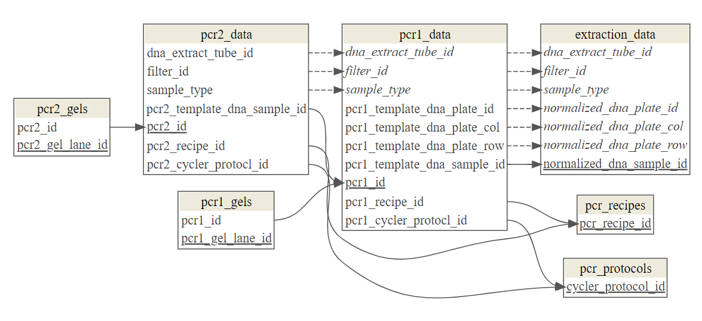

# Building Relational Data Models in **R** with the `dm` Package

Create, validate, and visualise a relational database directly from your data frames/tibbles—no external SQL server required.

---

## 1  Why use **{dm}?**
* Keep data in **R** yet enjoy referential-integrity checks, primary/foreign keys, and ER-diagramming.  
* Seamlessly push to / pull from backend DBs (SQLite, Postgres, etc.) when scale demands.  
* Pipe‐friendly verbs (`dm_add_pk()`, `dm_add_fk()`, `dm_draw()`, …) integrate with the **tidyverse**.

---

## 2  Prerequisites
```r
install.packages(c("dm", "tidyverse", "DiagrammeR"))   # DiagrammeR is pulled automatically by {dm}
```

## 3 Example script and dataset



Run `howto_relational-database-R/example_2stage_pcr_reldb.R`

```bash
how_to/
├── howto_relational-database-R/
│   ├── erd_detailed.png          # rendered ER diagram for the “all-keys” model
│   ├── example_2stage_pcr_reldb.R
│   └── example_2stage_pcr_reldb.rds
└── howto_relational-database-R.md  <- ← you are here
```

[Breakdown of Script](https://chatgpt.com/share/682cb6e5-fc28-800f-99bc-70823efe326e)