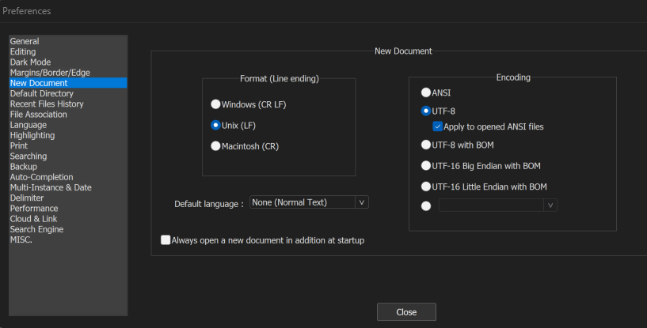

# Install a Text Editor for Coding

---

* Ubuntu should already have [gedit](https://help.gnome.org/users/gedit/stable/) installed

  * If not, you should be able to install it with the following commands
  
  ```bash
  sudo apt update
  sudo apt upgrade
  sudo apt install gedit
  ```

* [PC (Notepad++)](https://notepad-plus-plus.org/downloads/)
  
  * After installing, open `NotePad++` and goto `Settings/Preferences/New Document` and select the options in the screenshot below
  
  
  
* [MacOS (BBEdit)](https://www.barebones.com/products/textwrangler/download.html)

---

### [Return to How to Setup Your Computer for Computational Biology](https://github.com/tamucc-comp-bio/how_to/blob/main/howto_setup_computer.md)
